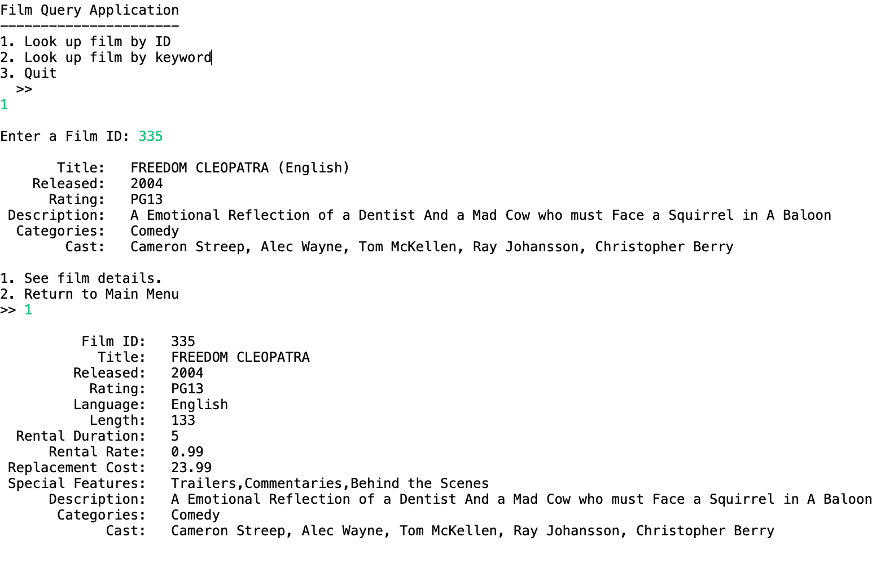

## Film Query Project
This Week 6 [Skill Distillery](http://skilldistillery.com) weekend homework utilizes Java to query a video rental SQL database.  

Users search through 1000 films either by ID or keyword and will be shown a brief summary of the movie(s). When searching by Film ID only, users can optionally choose to display every detail about the movie. Keyword searches will display all movies that match the keyword in the title or description.

The app is run only on the console and main can be found in FilmQueryApp.java.  Additionally, a fairly large SQL database is manipulated on localhost with mySQL.  The sample database is not provided here.

### Topics/Technologies
- SQL/mySQL
  - SELECT, INNER JOIN
  - SQL Injection Protection (Prepared Statements)
- JDBC
- Maven

  

